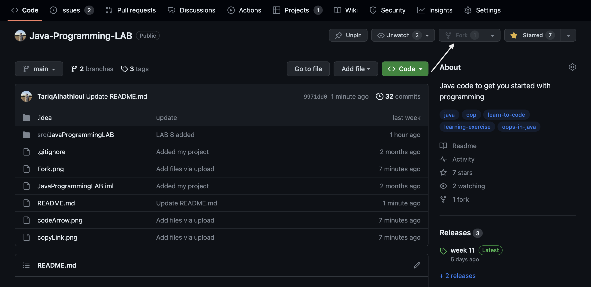

# SEU_LAB

### Welcome to JavaProgrammingLAB, your go-to resource for mastering Java programming from scratch! Whether you're a programming novice or transitioning from another language, this repository is designed to provide a smooth and comprehensive introduction to Java.
### Engage with a supportive community of fellow learners and experienced developers. Share your code, ask questions, and participate in discussions to enhance your understanding of Java programming.

## how to contribute to this repository?

## first fork the repository by clicking on the fork button.



## Clone the repository


### run this command to clone the repository
```
git clone https://github.com/TariqAlhathloul/Java-Programming-LAB.git
```


### After cloning the repository run this command
```
 cd Java-Programming-LAB
```

### create your branch
```
git switch -c add-your-branch-name
```

### create and/or modify files 


### add the files
```
git add fileName
```

> you can use ```git status``` to see the files changed 
### then comment your changes
```
git commit -m "anyComment"
```

### push your changes in github
```
git push -u origin your-branch-name
```
### finally go to your repository on gitHub, click on compare & pull request button.
### I will merge your contribution soon, thank you.
### Start your Java programming journey today with JavaProgrammingLAB. Happy coding!
 

##   هذا المستودع غير رسمي من الجامعة، فقط لغرض التدرب والتعلم.
